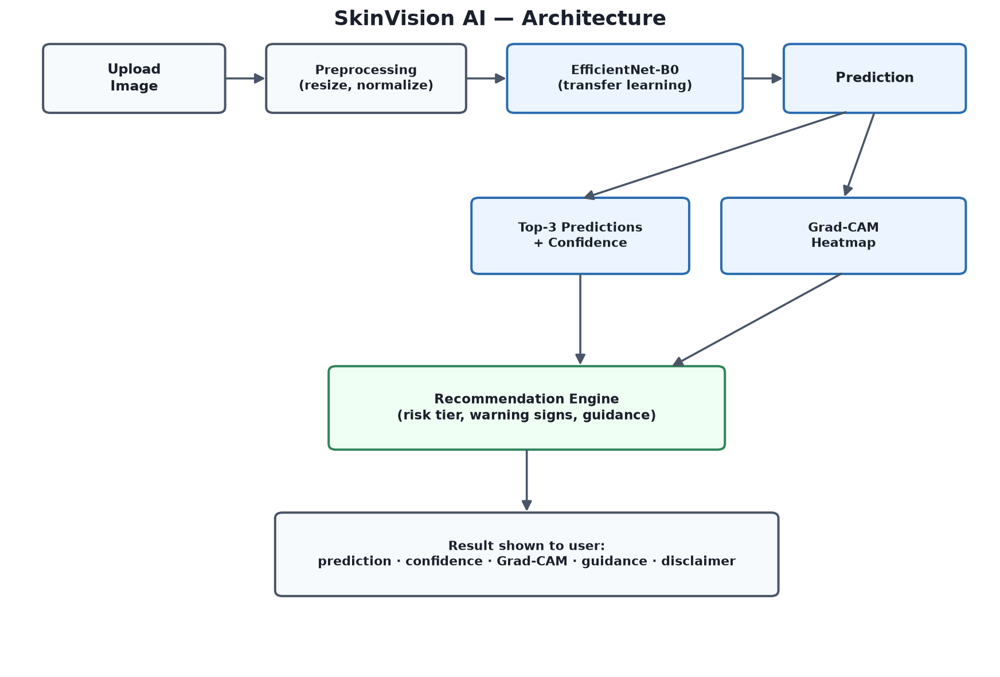
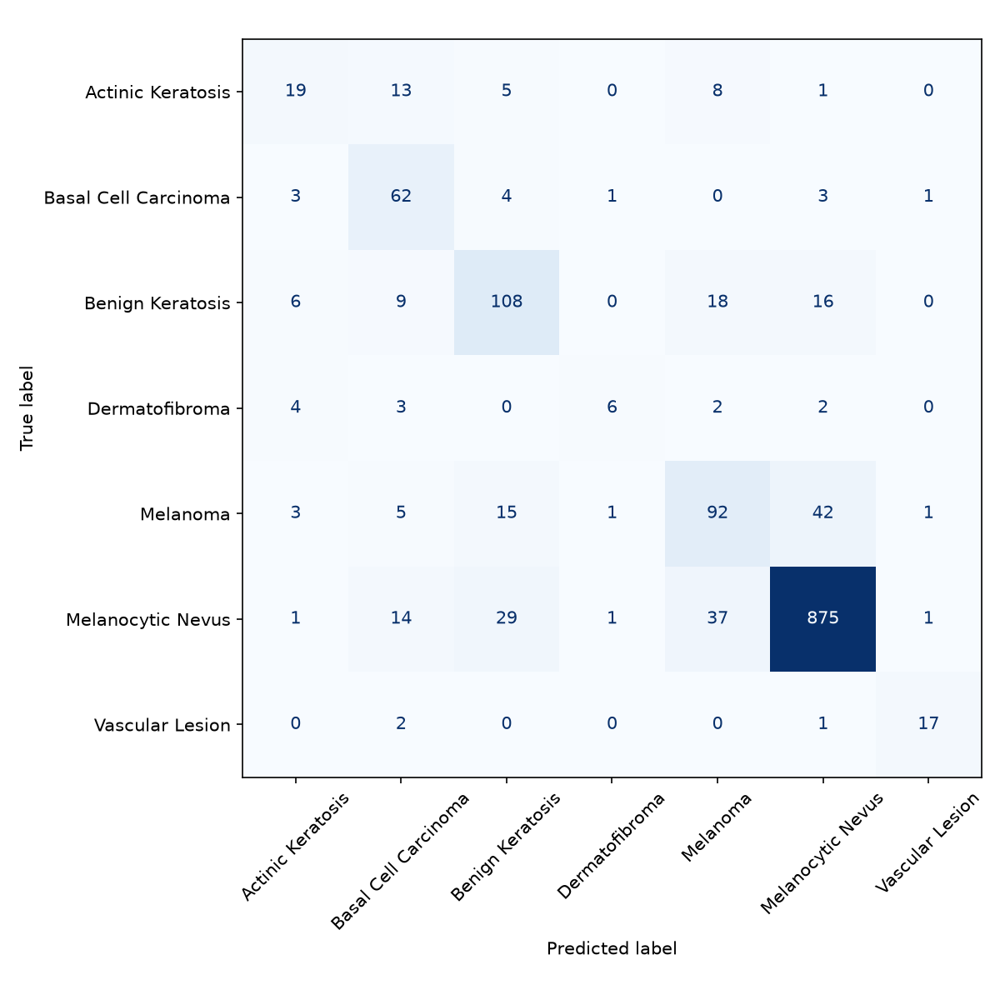

# 🩺 SkinVision AI

An explainable computer-vision web app that analyzes skin lesion images, predicts one of 7 HAM10000 lesion classes with a confidence score, visually explains the model's focus using Grad-CAM, and pairs the prediction with rule-based general guidance.

**This is an educational project — not a medical diagnostic tool.** Every result should be treated as a starting point for a conversation with a dermatologist, never as a diagnosis.

## What it does

1. Upload a skin lesion photo
2. A fine-tuned EfficientNet-B0 model predicts the most likely lesion class, with a confidence score and top-3 ranked predictions
3. Grad-CAM highlights the image regions the model focused on — answering "why did the AI make this prediction?"
4. A recommendation engine returns condition information, warning signs, and general guidance — escalating to "seek professional evaluation" automatically whenever confidence is low or the predicted class is one of the higher-risk categories. It never recommends medication — only general care, warning signs to watch for, and when to see a dermatologist.
5. Every scan is saved locally, so you can track how a lesion looks across scans over time (the "Track Changes Over Time" tab) and compare two past photos side by side

## Dataset & classes

Trained on [HAM10000](https://doi.org/10.1038/sdata.2018.161) (10,015 dermoscopic images, 7 diagnostic categories):

| Code    | Condition             | Risk tier                  |
| ------- | ---------------------- | --------------------------- |
| `akiec` | Actinic Keratosis       | 🔴 Professional evaluation |
| `bcc`   | Basal Cell Carcinoma    | 🔴 Professional evaluation |
| `bkl`   | Benign Keratosis        | 🟢 Lower concern           |
| `df`    | Dermatofibroma          | 🟢 Lower concern           |
| `mel`   | Melanoma                | 🔴 Professional evaluation |
| `nv`    | Melanocytic Nevus       | 🟢 Lower concern           |
| `vasc`  | Vascular Lesion         | 🟢 Lower concern           |

## Architecture



## Project structure

```
SkinVision-AI/
├── app.py                    # Gradio web app (entry point)
├── data/                     # HAM10000 images + metadata (not committed — see below)
├── models/                   # trained checkpoints (not committed — see below)
├── outputs/                  # training history, evaluation report, confusion matrix
├── notebooks/EDA.ipynb       # exploratory data analysis
└── src/
    ├── config.py             # hyperparameters, class labels, paths
    ├── dataset.py            # HAM10000Dataset (PyTorch Dataset)
    ├── transforms.py         # albumentations pipelines
    ├── model.py               # EfficientNet-B0 (timm) transfer-learning model
    ├── train.py               # training loop (weighted loss, checkpointing)
    ├── evaluate.py             # test-set metrics: accuracy, F1, ROC-AUC, confusion matrix
    ├── gradcam.py              # Grad-CAM explainability
    ├── conditions.json         # per-class descriptions, warning signs, guidance
    ├── recommendation.py       # maps a prediction → recommendation + risk tier
    ├── history.py               # local scan history log (for tracking changes over time)
    ├── predict.py               # end-to-end inference pipeline (used by app.py)
    └── utils.py                 # seeding, checkpoints, grouped/stratified data split
```

## Setup

```bash
python -m venv venv
venv\Scripts\activate        # Windows
pip install -r requirements.txt
```

Download [HAM10000](https://doi.org/10.7910/DVN/DBW86T) into `data/HAM10000_images/` and `data/HAM10000_metadata.csv`, then run `notebooks/EDA.ipynb` to generate `data/processed_metadata.csv`.

## Training

```bash
cd src
python train.py
```

Trains an EfficientNet-B0 with class-weighted loss (to counter HAM10000's ~67%/1% class imbalance) on a lesion-grouped, stratified train/val/test split (grouping by `lesion_id` prevents the same lesion's multiple photos from leaking across splits). Saves the best checkpoint to `models/best_model.pth`.

## Evaluation

```bash
cd src
python evaluate.py
```

Reports accuracy, per-class precision/recall/F1, macro ROC-AUC, and saves a confusion matrix to `outputs/`.

## Running the app

```bash
python app.py
```

## Results

EfficientNet-B0 trained for 15 epochs on the lesion-grouped, stratified split, evaluated on the 1,431-image held-out test set (never seen during training):

| Metric | Score |
| --- | --- |
| Test accuracy | 82.4% |
| Macro F1 | 0.663 |
| Macro ROC-AUC (OVR) | 0.953 |



Melanocytic Nevus (the dominant class) reaches 0.92 F1; the rarest class, Dermatofibroma, is the weakest at 0.46 F1 — expected given it has only 17 test images. Full per-class precision/recall/F1 is in `outputs/evaluation_report.json`.

## Limitations & disclaimer

SkinVision AI is an educational AI project and is **not** a medical diagnostic tool. Predictions are generated from image patterns and may be incorrect. They should not replace examination or advice from a qualified healthcare professional. For potentially concerning predictions, professional evaluation is always recommended — this application does not, and should not, prescribe treatment.
